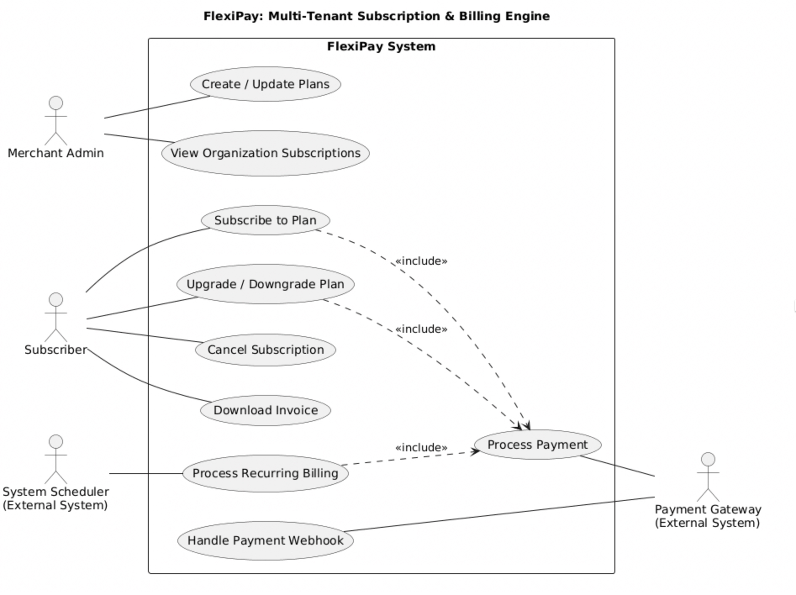

# Use Case Diagram 

## Overview

This use case diagram represents the primary interactions between external actors and the FlexiPay system. It models how merchant administrators, subscribers, external schedulers, and payment gateways interact with the billing engine.

The diagram focuses on subscription lifecycle management, recurring billing execution, and payment processing abstraction.

---

## Actors

**Merchant Admin**
- Creates and updates subscription plans
- Views organization-level subscriptions

**Subscriber**
- Subscribes to plans
- Upgrades or downgrades plans
- Cancels subscriptions
- Downloads invoices

**System Scheduler (External System)**
- Triggers recurring billing operations

**Payment Gateway (External System)**
- Processes payment transactions
- Sends webhook notifications for payment events

---

## Key Relationships

- *Subscribe to Plan*, *Upgrade/Downgrade Plan*, and *Process Recurring Billing* include the *Process Payment* use case.
- Recurring billing is triggered by the System Scheduler.
- Payment confirmations are handled via webhook interactions with the Payment Gateway.

---

